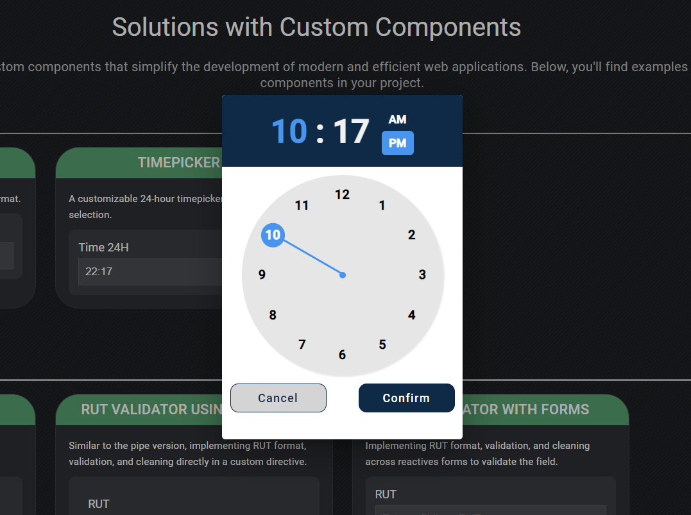

# CustomTimepicker

This project was generated with [Angular CLI](https://github.com/angular/angular-cli) version 17.3.8.

## Development server

Run `ng serve` for a dev server. Navigate to `http://localhost:4200/`. The application will automatically reload if you change any of the source files.

## About the Project

This project is an educational example demonstrating a custom timepicker inspired by the ngx-material-timepicker library.

You can explore two types of timepickers:

- **12-Hour Format**: A timepicker displaying hours in a 12-hour format with AM/PM selection.

    
    

- **24-Hour Format**: A timepicker displaying hours in a 24-hour format, offering a more extensive range of time selection.

    
    

## Flexibility and Scalability

- **Adaptability**: This timepicker is easily adaptable to other frameworks or libraries, as long as JavaScript is used as the programming language.

- **Scalability**: The project is designed for easy scalability, allowing for straightforward modifications to the design or functionality. You can easily integrate or adapt the clock component into other parts of your application.

## Additional Libraries (not mandatory)

- **[Angular Material v17](https://v17.material.angular.io/)**: Angular Material helps you build consistent, high-quality UI components with a modern design system and a flexible API. It provides a robust set of components and design options to create an appealing and functional user interface.

##

This revised README should give a clear overview of your project, its purpose, and how it can be adapted and scaled. If you need further adjustments, feel free to ask!
