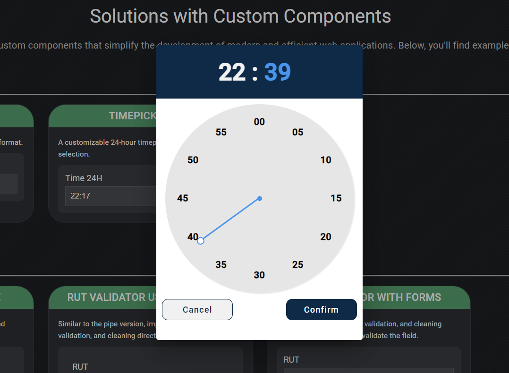
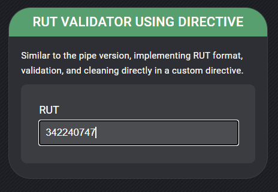

# Custom Components Showcase

This project was generated with [Angular CLI](https://github.com/angular/angular-cli) version 17.3.8.

## Development server

Run `ng serve` for a dev server. Navigate to `http://localhost:4200/`. The application will automatically reload if you change any of the source files.

## About the Project

This project is an educational showcase demonstrating various custom components, each designed to replicate or extend the functionality of popular third-party libraries. The goal is to provide reusable, customizable components that can be easily integrated into any framework or library based on JavaScript, allowing you to adapt them to your specific needs without the need for additional external dependencies.

### Featured Components

#### 1. **Custom Timepickers**

Explore two types of timepickers inspired by the `ngx-material-timepicker` library:

- **12-Hour Format**: A timepicker displaying hours in a 12-hour format with AM/PM selection.
<p align="center">
    
    
</p>

- **24-Hour Format**: A timepicker displaying hours in a 24-hour format, offering a more extensive range of time selection.
<p align="center">
    
    
</p>

#### 2. **Chilean RUT Validators**

Replicating the functionality of the `ng9-rut` library, these components offer robust RUT (Rol Único Tributario) validation:

- **RUT Validator Using Pipe**: Validates and formats the RUT using a custom pipe, ensuring proper format and integrity.
<p align="center">
    
</p>

- **RUT Validator Using Directive**: Implements RUT validation directly via a custom directive, offering an alternative method to handle RUT data.
<p align="center">
    
    
</p>

- **RUT Validator with Reactives Forms**: Implementing RUT format, validation, and cleaning across reactives forms to validate the field.
<p align="center">
    
    
    
</p>

#### 3. **International Phone Number Input**

Inspired by the `ngx-intl-tel-input` library, this component allows users to input and validate international phone numbers:

- **International Phone Input**: Provides country code selection and phone number formatting based on the selected region.
<p align="center">
    
</p>

## Flexibility and Scalability

- **Adaptability**: Each component is designed to be easily adaptable to other frameworks or libraries, as long as JavaScript is used as the programming language.

- **Scalability**: The project is built with scalability in mind, allowing for straightforward modifications to the design or functionality. You can easily integrate or adapt these components into other parts of your application.

## Additional Libraries (not mandatory)

- **[Angular Material v17](https://v17.material.angular.io/)**: Angular Material helps you build consistent, high-quality UI components with a modern design system and a flexible API. It provides a robust set of components and design options to create an appealing and functional user interface.

## Getting Started

Clone this repository and follow the steps below to get started with the development server.

```bash
git clone https://github.com/edgarbenitez92/custom-components-showcase.git

cd custom-components-showcase

npm install

ng serve
```
